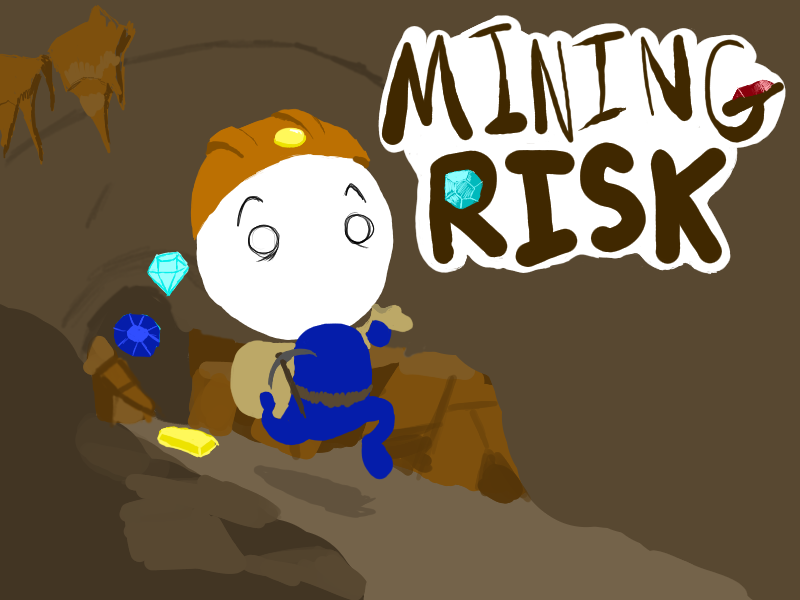
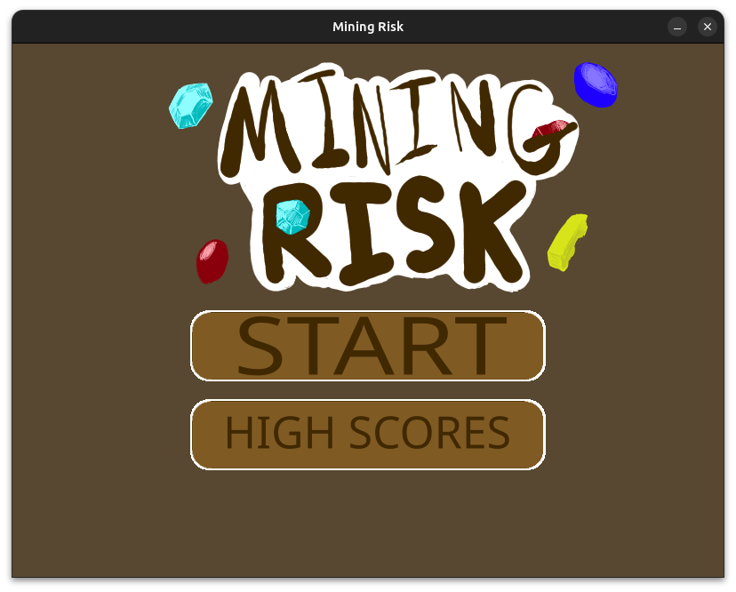
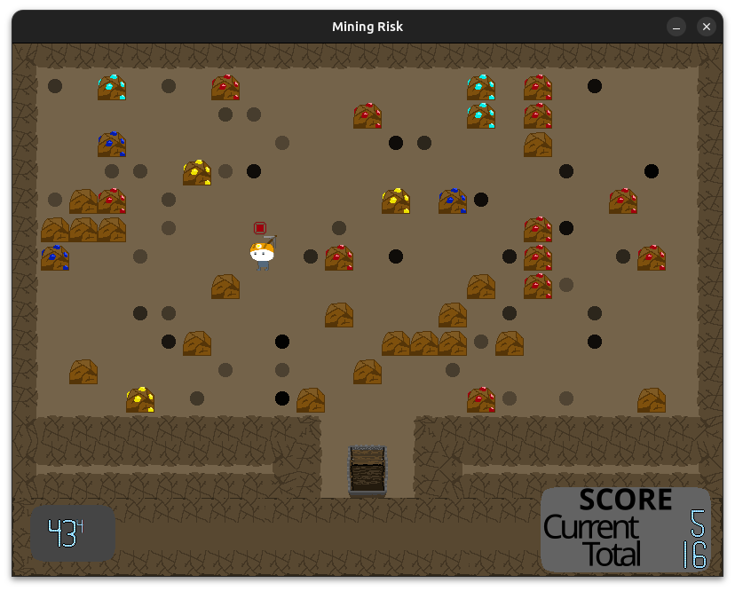

# Mining Risk!
A simple mining-themed score-attack game made using Lua and the gaming 
framework Love2D. The object of the game is to mine as many gemstones 
as you can on each floor before the room collapses. The main gameplay 
loop focuses on a risk versus reward system where the more gems a player 
mines on each floor, the faster the current room will collapse.



## Motivation
The following project was made for the 166 MiniJam hosted on itch.io and 
released on September 02, 2024. It was also a challenge for myself to 
see if I could create and release a game within a fixed timeframe.

This project has been uploaded to GitHub to be shown as an example of work. 

## How to Start
Requires installing the game framework [Love2D](https://love2d.org/)

Must be launched above the current directory.

Just run the following in a command line 
```
love MiningRisk_MiniJam116
```



## How to Play 
### Controls
**WASD** - Movement\
**Mouse Cursor** - Aiming and Menu Selection\
**Mouse Left-Click** - Mining


Your character's mining spot is respresented by a red target between
the character and the mouse cursor. Any rocks that overlap with this
target will be mined when you click with the left mouse button. 

To raise your score, you must mine the rocks that are shown to contain
gemstones, which come in red, gold, blue, and cyan. These rocks will
both raise your score, and increase the speed at which the current room will collapse.

To leave the current room and reset the timer, you must walk into the 
minecart at the bottom of every room and click the  left mouse-button.
Alternatively, you can exit the cart by simply clicking 'w.' Leaving the
current room will add your current score to your overall total. Any points that are not added to this total are lost when you get a game over.

## Credits
### Music
"8bit Dungeon Boss" Kevin MacLeod (incompetech.com)
Licensed under Creative Commons: By Attribution 4.0 License
http://creativecommons.org/licenses/by/4.0/

"8bit Dungeon Level" Kevin MacLeod (incompetech.com)
Licensed under Creative Commons: By Attribution 4.0 License
http://creativecommons.org/licenses/by/4.0/

### Sound Effects
The #GameAudioGDC Bundle 2021 https://sonniss.com/gameaudiogdc\
Chiptone by SFBGames https://sfbgames.itch.io/chiptone